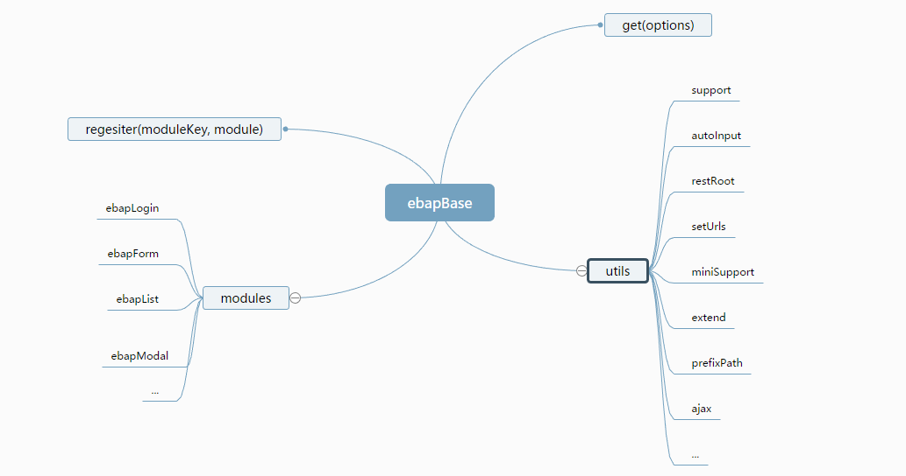

# tnt.js


## 依赖

1. [jquery](http://www.jquery.com)
2. [miniui](http://www.miniui.com)

## 理念

1. 底层隔离，不直接依赖具体的框架
2. 快速沉淀业务中常用的功能
3. 模块可以自由组合使用
4. 只需简单修改就可以和其他ui框架一起使用

## 项目中使用方式

1. 引入需要的miniui和jquery.js以及基础文件base.js
2. 命名base.项目名称.js作为当前项目的扩展模块,并引入到当前页面中
3. 编写当前页面需要的js，书写方式如下:
```javascript
// 模块编写
function ebapDemo (options) {
    // 简化分析options步骤
    // 比如获取id值可以这样 parseOBK('id', ''); 
    // 指的是获取options.id, 如果options.id不存在，则返回空字符串
    var po = ebapUtils.getAllOptions(options);
    var self = {
        start: function (opts) {
            var dpo = ebapUtils.genDpo(self, opts, options);
            /*
              deepParseOBK('id', '');
              如果opts.id不存在，则判断options.id是否存在，如果不存在，则设置为空字符串默认值
            */
            var tipMsg = dpo('tipMsg', 'ok');
            alert(tipMsg);
        }
    }
}
// 注册模块
ebapBase.regesiter({
    'demo': ebapDemo
});
// 初始化实例
var ebapIns = ebapBase.get({
    id: '',
    key: '',
    settings: {

    },
    deps: [{
        key: 'demo'
    }],
    beforeParse: function (options) {
        // 在调用mi.parse之前
    },
    beforeCreate: function(options) {
        // 默认传入的是组件当前的配置
        // 依赖分析完成，待调用组件模块前
    },
    created: function (comIns) {
        // 当前的ui组件实例，以miniui为例，指的就是id对应的miniui组件实例
        // 对于没有id的模块，comIns等于模块实例
    },
    mounted: function (moduleIns) {
        // 已经获取模块，即将返回，在这里可以对模块进行扩展，比如
        moduleIns = $.extend(true, moduleIns, {
            search: function () {
                // 对模块进行扩展
            }
        });
        // 调用依赖模块
        moduleIns.moudleDeps.demo.start({
            tipMsg: 'ccc'
        });
        return moduleIns;
    }
});
// ok 这样一个页面的功能就开发完了
```

